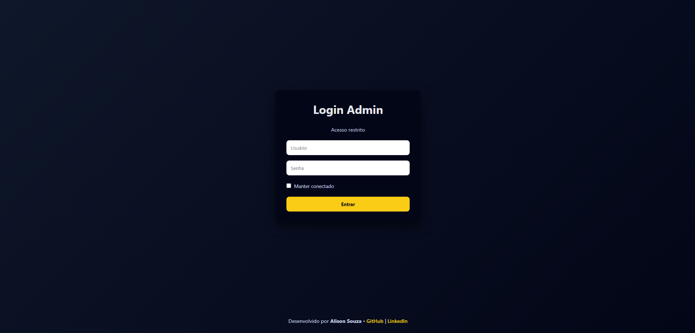
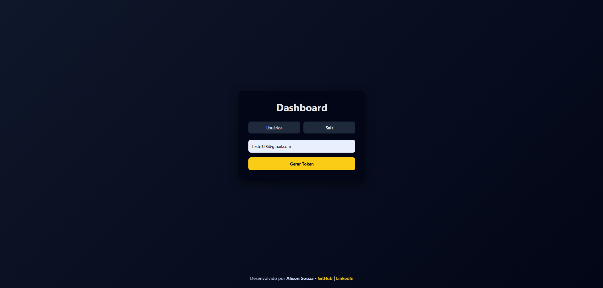
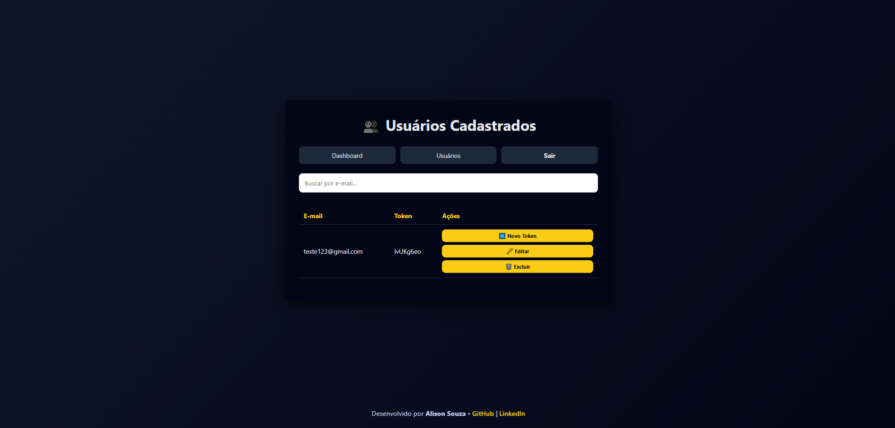

# 🔐 Gerador de Tokens com Envio por E-mail


## 💻 Preview






Aplicação web desenvolvida com **HTML, CSS e JavaScript puro**, focada na geração e gerenciamento de tokens vinculados a e-mails, com **envio automático via EmailJS**.  
O projeto simula um sistema administrativo real, com autenticação, dashboard e gerenciamento de usuários.

---

## 📸 Visão Geral

O sistema permite:

- Login com autenticação
- Geração de tokens únicos
- Envio automático de tokens por e-mail
- Gerenciamento completo de usuários
- Busca dinâmica
- Persistência de dados no navegador

Projeto desenvolvido com foco em **boas práticas, organização de código e experiência do usuário**, ideal para demonstração de habilidades em vagas de estágio e júnior.

---

## 🚀 Funcionalidades

### 🔑 Autenticação

- Login com validação
- Opção **“manter conectado”**
- Proteção de rotas via `localStorage`

### 📊 Dashboard

- Geração de token vinculada a um e-mail
- Envio automático do token via **EmailJS**
- Validação para impedir cadastro de e-mails duplicados
- Feedback visual de loading, sucesso e erro

### 👥 Página de Usuários

- Listagem em tabela
- Busca dinâmica por e-mail
- Geração de novo token com reenvio por e-mail
- Edição de e-mail
- Exclusão de usuários
- Dados persistidos no `localStorage`

### 🎨 Interface

- Layout moderno e responsivo
- Feedback visual (loading, sucesso, erro)
- Footer fixo com links profissionais

---

## 🛠️ Tecnologias Utilizadas

- **HTML5**
- **CSS3**
- **JavaScript (Vanilla JS)**
- **EmailJS**
- **LocalStorage**

---

## 📂 Estrutura do Projeto

```text
📦 token-generator
┣ 📂 css
┃ ┗ style.css
┣ 📂 js
┃ ┣ auth.js
┃ ┣ dashboard.js
┃ ┗ usuarios.js
┣ 📂 pages
┃ ┣ login.html
┃ ┣ dashboard.html
┃ ┗ usuarios.html
┗ README.md
```

---

## ⚙️ Como Executar o Projeto

1. Cloque o repositório:

```bash
git clone https://github.com/alison-souza/token-generator.git
```

2. Abra o arquivo **login.html** no navegador ou utilize uma extensão como **Live Server** no VS Code

3. Configure o EmailJS:

   - Crie uma conta em **https://www.emailjs.com/**

   - Configure um serviço de e-mail

   - Crie um template

   - Substitua no código:

     - PUBLIC_KEY

     - SERVICE_ID

     - TEMPLATE_ID

---

## 📧 Envio de E-mails

O envio de tokens é feito utilizando o EmailJS, permitindo disparo de e-mails diretamente do front-end, sem necessidade de backend.

**Campos utilizados no template:**

- email

- token

---

## 📌 Melhorias Futuras

- Backend com Node.js

- Banco de dados real

- Criptografia de tokens

- Níveis de permissão (admin / usuário)

- Expiração automática de tokens

- Deploy online

---

**⭐ Se este projeto te ajudou ou chamou sua atenção, deixe uma estrela no repositório!**
